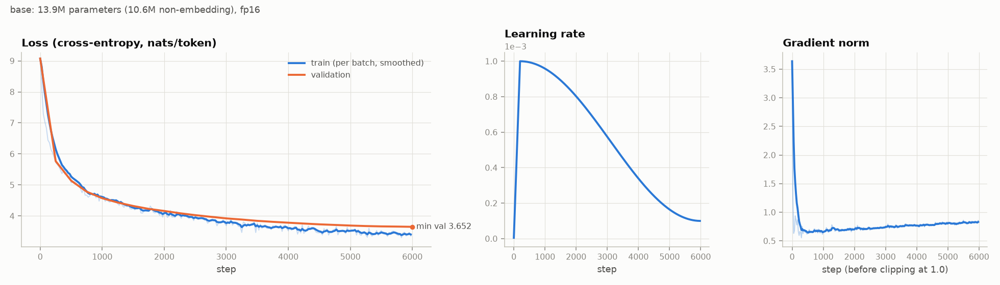
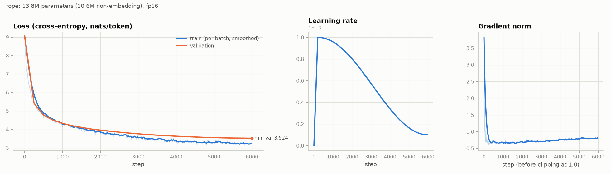

# Kindling 🔥

**A small GPT language model built from scratch and trained on Romanian text.**

Kindling is the small dry wood you use to get a real fire going. This project is the same idea for language
models: a small Transformer, built from nothing, that shows how the large ones actually work.

Everything is implemented explicitly in PyTorch, with no high-level libraries (no `transformers`, `tokenizers`,
`datasets` or `lightning`): the BPE tokenizer, multi-head attention, the AdamW optimizer, the learning-rate
schedule, mixed precision, KV-cached generation and the whole evaluation suite.

> **Expectations:** the model has ~14M parameters and trains in ~20 minutes on an RTX 2060. It writes
> grammatical Romanian in short stretches but loses the thread over longer passages. The value of this
> project is in understanding the mechanism, not in the quality of the text.

## Results at a glance

Evaluated on the **test** split (355k tokens of unseen text, sliding-window evaluation):

| Model | Parameters | Perplexity | Bits/byte | Top-1 accuracy | Training time |
|---|---:|---:|---:|---:|---:|
| uniform guess | – | 8192 | – | – | – |
| unigram (token frequencies only) | – | 1578 | 2.79 | – | – |
| GPT, learned positions (`runs/base`) | 13.9M | 37.1 | 1.367 | 34.2% | 16 min |
| **GPT, RoPE** (`runs/rope`) | 13.8M | **32.3** | **1.315** | **36.3%** | 19 min |

A sample from the best model (not cherry-picked; prompt in bold, English translation below):

> **În anul 1918,** când au fost recrutați în Armata Română, în urma răscoalei din Chișinău și Mărășești,
> în calitate de comandant militar român, au fost uciși sau uciși în cursul războiului.
>
> *In the year 1918, when they were recruited into the Romanian Army, following the uprising in Chișinău
> and Mărășești, as Romanian military commander, they were killed or killed during the war.*

Grammar, diacritics, agreement and encyclopedic style are all correct locally. The meaning falls apart
over longer stretches, which is what you'd expect from ~14M parameters trained for 20 minutes.

---

## Contents

1. [Quick start](#1-quick-start)
2. [Project structure](#2-project-structure)
3. [How it works, step by step](#3-how-it-works-step-by-step)
4. [Evaluation: perplexity, ablations, curves](#4-evaluation-perplexity-ablations-curves)
5. [Development log: real problems and how they were solved](#5-development-log-real-problems-and-how-they-were-solved)
6. [Publishing to GitHub](#6-publishing-to-github)

---

## 1. Quick start

### On a machine where everything is already set up

If the virtual environment, the data and the trained models are already in the folder, there's nothing
to install or train. Open a terminal in the project folder (in VS Code: *Terminal → New Terminal*) and run:

```powershell
.\.venv\Scripts\python.exe generate.py --ckpt runs/rope/best.pt --interactive
```

Wait for the `>` prompt, type the beginning of a sentence **in Romanian** (for example `În anul 1918,`)
and press Enter; the model continues the text. You can enter as many prompts as you like. Type `exit`
(or press Ctrl+C) to quit. Empty lines are ignored, so a stray Enter from pasting the command won't
close the program.

These commands call the environment's Python directly (`.\.venv\Scripts\python.exe`), so you don't need
to activate the virtual environment, and you avoid PowerShell's common "execution policy" error.

Other useful commands:

```powershell
# a single continuation of your own prompt
.\.venv\Scripts\python.exe generate.py --ckpt runs/rope/best.pt --prompt "Bucureștiul este"

# safer text (low temperature) vs. more adventurous text (high temperature)
.\.venv\Scripts\python.exe generate.py --ckpt runs/rope/best.pt --prompt "Dragostea" --temperature 0.5
.\.venv\Scripts\python.exe generate.py --ckpt runs/rope/best.pt --prompt "Dragostea" --temperature 1.2

# the model's scores on the test set
.\.venv\Scripts\python.exe evaluate.py perplexity --ckpt runs/rope/best.pt --split test

# check that all the code is correct (24 tests)
.\.venv\Scripts\python.exe -m pytest tests -q
```

> Don't rename or move the project folder after creating `.venv`: the virtual environment stores
> absolute paths. If you do move it, delete `.venv` and recreate it with the steps below.

### From scratch, on a new machine

Requirements: Python 3.10+ (tested on **Python 3.14.7**) and, optionally, an NVIDIA GPU. It runs on a
CPU too, just much more slowly.

```powershell
# 1. virtual environment
python -m venv .venv
.\.venv\Scripts\Activate.ps1            # Linux/macOS: source .venv/bin/activate

# 2. PyTorch with CUDA (pick the right build for your GPU at https://pytorch.org/get-started/locally/)
pip install torch --index-url https://download.pytorch.org/whl/cu128
pip install -r requirements.txt

# 3. verify the implementation (24 tests, ~5 seconds)
python -m pytest tests -q

# 4. the full pipeline
python prepare_data.py                  # download and clean the corpus      (~15 min, once)
python train_tokenizer.py               # BPE with 8192 tokens               (~1 min)
python train.py                         # train the model                    (~16 min on an RTX 2060)
python train.py --pos_emb rope --out_dir runs/rope   # the better RoPE variant (~19 min)
python generate.py --ckpt runs/rope/best.pt --prompt "A fost odată ca niciodată"
python evaluate.py perplexity --ckpt runs/rope/best.pt --split test
python evaluate.py curves --runs runs/base runs/rope
python ablations.py                     # 8 variants x 2000 steps            (~45 min)
```

Just want to see that everything runs, without waiting? Use the tiny preset:

```powershell
python train.py --preset smoke --out_dir runs/smoke
python generate.py --ckpt runs/smoke/best.pt --prompt "România"
```

---

## 2. Project structure

```text
tinyllm/
  tokenizer.py   byte-level BPE: incremental training with a heap, encode/decode, save/load
  model.py       LayerNorm, RoPE, causal multi-head attention (manual + SDPA), MLP, block, GPT, KV cache
  optim.py       hand-written AdamW, warmup + cosine schedule, gradient clipping
  data.py        memmap reading of the tokens and batch construction
  runtime.py     device/precision selection, autocast, checkpoint loading
  config.py      configs (dataclasses) -> auto-generated CLI arguments, presets
  plotting.py    chart style
prepare_data.py     step 1: download + clean + train/val/test split
train_tokenizer.py  step 2: train BPE + encode the corpus into .bin files (uint16)
train.py            step 3: the training loop
generate.py         step 4: text generation (temperature, top-k, top-p, KV cache)
evaluate.py         step 5: perplexity, bits-per-byte, learning curves, samples
ablations.py        step 6: 8 identically trained variants, each with one component changed
tests/              tests of mathematical properties (causality, KV cache, AdamW, ...)
reports/            generated charts and tables (committed to the repo)
```

Every field in `ModelConfig` / `TrainConfig` ([tinyllm/config.py](tinyllm/config.py)) automatically becomes
a command-line argument: `python train.py --n_layer 8 --lr 5e-4 --pos_emb rope`.

---

## 3. How it works, step by step

A language model is a function that takes a sequence of tokens and returns a probability distribution
over the next token. Training means adjusting millions of numbers so that the probability assigned to
the correct next token is as high as possible. Generating means picking a token from that distribution,
appending it to the text, and repeating.

```text
text ──► tokenizer ──► [412, 87, 3051, ...] ──► Transformer ──► P(next token) ──► loss / sampling
```

### 3.1 The data ([prepare_data.py](prepare_data.py))

* **Sources:** the *featured* and *good* articles from ro.wikipedia.org (~690 long, community-reviewed
  articles) and the Romanian-language books on Project Gutenberg.
* **Cleaning:** Unicode NFC normalization, `ş/ţ` (cedilla, wrong) → `ș/ț` (comma, correct), removal of
  the notes and bibliography lists and of artifacts such as `[necesită citare]` ("[citation needed]").
* **Split by document**, not by character: long documents are cut into ~6000-character pieces at paragraph
  boundaries, shuffled with a fixed seed and split 90% / 5% / 5%. The test text is never seen by the
  tokenizer or the model.
* Documents are separated by the special token `<|endoftext|>`.

### 3.2 The BPE tokenizer ([tinyllm/tokenizer.py](tinyllm/tokenizer.py))

The network works with numbers, not letters. **Byte Pair Encoding** builds the vocabulary like this:

1. Start from the 256 possible bytes. Any UTF-8 text can be represented, so there are no "unknown
   words". `ș` takes 2 bytes, `🙂` takes 4.
2. Count every pair of adjacent tokens in the corpus.
3. Merge the most frequent pair into a new token (e.g. `0xC8 0x99` → `ș`, then `ș`+`i` → `și` ("and"),
   then ` `+`și` → ` și`).
4. Repeat until the vocabulary reaches the target size (8192).

**Pre-tokenization:** the text is first cut with a regular expression into words (with their leading
space), numbers, punctuation and whitespace. Merges may not cross these boundaries; otherwise you get
tokens like `a.` or `e d` that waste vocabulary slots.

**Why the implementation matters:** the naive version recounts every pair after every merge. For ~8000
merges over ~20M characters, that takes hours in Python. This implementation:

* works on **unique words with their frequencies** (`" și"` occurs 100,000 times but is processed once);
* keeps an index `pair → words containing it` and **updates incrementally** only the affected words;
* picks the best pair from a **heap with lazy invalidation** instead of a `max()` over the whole dictionary.

Result: seconds instead of hours. During encoding, the result for each word is cached.

### 3.3 The model ([tinyllm/model.py](tinyllm/model.py))

```text
tokens (B, T)
  └─► token embedding (V × 384)  +  position embedding (256 × 384)       → x: (B, T, 384)
       └─► 6 × Block:
             x = x + Attention(LayerNorm(x))     ← tokens exchange information
             x = x + MLP(LayerNorm(x))           ← each token is processed on its own
  └─► LayerNorm  └─► Linear (384 × V), weights tied to the embedding      → logits: (B, T, V)
```

**Causal multi-head attention**, the heart of the model:

```python
q, k, v = self.qkv(x).split(C, dim=2)              # 3 linear projections of every token
att = (q @ k.transpose(-2, -1)) / sqrt(head_dim)   # how relevant token j is to token i
att = att.masked_fill(~mask, float("-inf"))        # i may not see j > i (the future)
att = softmax(att)                                 # weights that sum to 1
y = att @ v                                        # a weighted average of the information
```

* **Q** ("what am I looking for"), **K** ("what do I contain"), **V** ("what do I pass on"). A high `q·k`
  score means token i takes a lot from token j's value.
* **Dividing by √d** keeps the scores in a reasonable range. Without it, the softmax saturates and the
  gradients vanish.
* **The causal mask** is what makes the model generative: during training all 256 positions are predicted
  in parallel, but each one only from its own past.
* **Multi-head:** the 384 dimensions are split into 6 heads of 64. Each head can learn a different kind
  of relationship (for example, one tracks subject-verb agreement, another tracks open quotation marks).
* There's also `attn_impl="sdpa"`, which uses PyTorch's fused kernel. A test checks that it gives exactly
  the same result as the manual version.

**The other pieces:**

| Component | What it does | Why |
|---|---|---|
| Position embedding | adds a learned vector for each position 0..255 | attention on its own has no idea of token order |
| RoPE (optional) | rotates q and k by an angle proportional to the position | `q·k` then depends only on relative distance; used by LLaMA |
| LayerNorm | brings each vector to mean 0 and variance 1 | stabilizes training of deep networks |
| Residual connections `x + f(x)` | each block *adds* something to the stream | gradients flow straight back to the first layers |
| MLP 384→1536→384 + GELU | a per-token non-linear transformation | where most of the "knowledge" lives |
| Tied weights | output head = the embedding matrix | saves 3M parameters; input and output share the same meaning |
| Initialization | N(0, 0.02); residual projections ÷ √(2·layers) | the residual stream's variance doesn't grow with depth |

**KV cache:** during generation, the K and V of earlier tokens never change, so they're kept. At each new
step the model processes **a single token** instead of the whole context.

### 3.4 Training ([train.py](train.py), [tinyllm/optim.py](tinyllm/optim.py))

One training step:

```python
x, y = batch()                     # 32 windows of 256 tokens; y = x shifted by 1
with autocast(fp16):               # forward pass in mixed precision
    _, loss = model(x, y)          # cross-entropy = -log P(correct token), averaged
scaler.scale(loss).backward()      # backpropagation: d(loss)/d(parameter) for all ~14M parameters
scaler.unscale_(optimizer)
clip_grad_norm(params, 1.0)        # cap overly large steps
scaler.step(optimizer)             # AdamW updates the parameters
scaler.update()
```

**Backpropagation.** `loss.backward()` applies the chain rule from the loss back through every operation
(softmax, matmul, LayerNorm, ...) and yields the gradient of each parameter: which direction to move it,
and how hard, for the loss to go down. PyTorch records the computation graph during the forward pass and
walks it in reverse.

**AdamW** (written by hand, checked by a test against `torch.optim.AdamW`):

```text
m = β1·m + (1-β1)·g          momentum: the average direction of the gradient
v = β2·v + (1-β2)·g²         how large/noisy the gradient is for this parameter
m̂ = m/(1-β1ᵗ), v̂ = v/(1-β2ᵗ)  correction: m and v start at 0
p = p - lr·wd·p              decoupled weight decay (only on matrices, not on biases/LayerNorm)
p = p - lr·m̂/(√v̂ + ε)        an adaptive step for each parameter
```

**Learning-rate schedule:** linear warmup over 200 steps (from 0 to 1e-3), then a cosine-shaped decay
down to 1e-4. At the start, m and v are poor estimates and the gradients are large, so warmup prevents
destructive early steps. At the end, small steps let the model "settle" into the minimum.

**Mixed precision (fp16):** matrix multiplications run in 16 bits (Tensor Cores: ~2× faster, half the
memory). The catch is that fp16 can't represent numbers below ~6·10⁻⁸, and many gradients are smaller
than that, so they become 0. The fix is the **GradScaler**: the loss is multiplied by ~65536 before
`backward()`, the gradients are divided back before the optimizer step, and if any `inf`/`NaN` shows up
the step is skipped and the factor is reduced. Sensitive operations (softmax, LayerNorm, cross-entropy)
stay in fp32.

> **bf16 vs. fp16:** on Ampere+ GPUs (RTX 30xx/40xx), bf16 has the same range as fp32 and needs no
> GradScaler. The RTX 2060 (Turing) has no native bf16, so `precision=auto` picks fp16 here.

**The rest of the loop:** evaluation every 250 steps on the same validation batches (so the curves are
comparable), a `best.pt` checkpoint at the best validation loss, `last.pt` at the end (`--resume`
continues from it), and a JSON log with loss, learning rate, gradient norm and tokens/s.

### 3.5 Generation ([generate.py](generate.py))

At each step the model produces one logit for each of the 8192 tokens:

* **temperature** divides the logits: below 1 makes the text safer and more repetitive, above 1 more
  varied and more chaotic;
* **top-k** keeps only the k most likely tokens;
* **top-p (nucleus)** keeps the smallest set of tokens whose probabilities add up to p;
* the chosen token is appended to the context and the step repeats. With the KV cache, only the new
  token is processed.

Text is printed as it's generated. Because a token can be only half of a UTF-8 character (the first byte
of `ș`), printing waits until the character is complete.

---

## 4. Evaluation: perplexity, ablations, curves

### 4.1 The metrics

| Metric | Formula | How to read it |
|---|---|---|
| **Loss** (cross-entropy) | mean of −ln P(correct token) | in nats/token; what training optimizes |
| **Perplexity** | exp(loss) | "the model hesitates between ~N tokens on average"; uniform = 8192 |
| **Bits-per-byte** | Σ loss / ln 2 / number of bytes of text | **tokenizer-independent**: fair comparison across vocabularies |
| **Top-1 accuracy** | how often the most likely token is the correct one | intuitive, but ignores how confident the model was |

**Sliding-window evaluation** ([evaluate.py](evaluate.py)): the test text is scanned with 256-token
windows and a stride of 128. Each token is scored exactly once, with at least 128 tokens of context.
With non-overlapping windows, the first tokens of every window would have almost no context and the
perplexity would come out artificially high. That's also why these numbers are slightly better than the
`val_loss` printed during training, which uses random windows.

**Baselines:** the *uniform* model (every token equally likely) and the *unigram* model (only the
frequency of each token in train). Any gain over unigram comes from using context.

### 4.2 Learning curves

```powershell
python evaluate.py curves --runs runs/base runs/rope
```



* **Loss** drops steeply in the first ~500 steps (the model learns token frequencies, then bigrams and
  morphology), then slowly. The train loss (blue) dips below validation after ~2000 steps: the corpus has
  6.3M tokens and training sees ~49M, i.e. ~7.8 epochs. So the model starts to memorize, but validation
  keeps improving until the end, which means the overfitting isn't harmful yet.
* **Learning rate:** linear warmup for 200 steps, then cosine from 1e-3 to 1e-4.
* **Gradient norm:** starts at ~3.6 (clipping at 1.0 is active for the first steps), drops to ~0.65, then
  rises slightly as the learning rate decreases. That's normal behavior, not a sign of instability.

### 4.3 Ablations

`python ablations.py` trains 8 variants that are **identical except for one thing**: same seed, same data,
2000 steps, same evaluation on the full validation set.


| variant | what changed | params | val loss | perplexity | bits/byte | Δ loss | tokens/s | time |
|---|---|---:|---:|---:|---:|---:|---:|---:|
| `baseline` | 6 layers, 6 heads, learned positions, warmup+cosine, fp16 | 10.6M | 4.102 | 60.5 | 1.545 | — | 52k | 5.3 min |
| `rope` | RoPE positions instead of a learned embedding | 10.6M | **3.875** | **48.2** | **1.459** | **−0.227** | 46k | 6.0 min |
| `no_pos` | no position information at all | 10.6M | 4.196 | 66.4 | 1.580 | +0.094 | 52k | 5.3 min |
| `one_head` | a single attention head (instead of 6) | 10.6M | 4.106 | 60.7 | 1.546 | +0.004 | 66k | 4.2 min |
| `shallow` | 2 layers instead of 6 | 3.5M | 4.195 | 66.4 | 1.580 | +0.093 | 117k | 2.4 min |
| `no_sched` | no warmup, constant learning rate | 10.6M | 4.435 | 84.4 | 1.670 | +0.333 | 52k | 5.4 min |
| `fp32` | no mixed precision (fp32 everywhere) | 10.6M | 4.109 | 60.9 | 1.548 | +0.008 | 32k | 8.6 min |
| `sdpa` | PyTorch's fused attention kernel | 10.6M | 4.103 | 60.5 | 1.545 | +0.001 | **68k** | **4.0 min** |

(Parameter counts are non-embedding.)

**What we learned:**

1. **The learning-rate schedule matters most** (+0.333 without it). Without warmup, the first steps at
   lr = 1e-3 on a freshly initialized model push it somewhere bad. Without the final decay, the model
   bounces around the minimum instead of settling into it. The green curve starts higher and never
   catches up.
2. **RoPE wins clearly** (−0.227, i.e. 20% lower perplexity). A learned embedding has to learn each of
   the 256 positions separately from the data. RoPE builds *relative distance* directly into the q·k
   product, so "the previous word" is the same kind of relationship anywhere in the window. That's why
   LLaMA, Mistral and almost every modern model use it. (The cost: ~12% slower, because of the
   hand-written rotations.)
3. **Without positions, the model still learns** (only +0.094). It sounds paradoxical, but the causal
   mask itself leaks position information: the token at position i averages over exactly i+1 values, so
   the model can roughly infer where it is.
4. **Depth matters:** 2 layers instead of 6 costs +0.093. Still, the model with 3× fewer parameters is
   only 0.09 behind and 2.2× faster, so on a fixed *time* budget a smaller model can be the better choice.
5. **Mixed precision is free:** fp32 reaches the same loss (the 0.008 difference is noise) but is
   **1.6× slower**. On Turing, Tensor Cores only work in fp16.
6. **SDPA = the manual attention, but 30% faster.** Same loss, which confirms the equivalence test. The
   fused kernel never materializes the T × T attention matrix in memory.
7. **1 head vs. 6: practically a tie** (+0.004). It's a surprising result, but consistent with the
   literature (Michel et al., 2019, *"Are Sixteen Heads Really Better than One?"*): in small models and
   short training runs, many heads are redundant. The difference usually shows up at larger scale. Also,
   a single head of 384 dimensions has more capacity than each of six heads of 64.

> **How reliable are these numbers?** Each variant ran once (a single seed). Differences below
> ~0.01–0.02 (`one_head`, `fp32`, `sdpa`) are within noise. Those of 0.09 and above are clear: the curves
> separate from the first evaluations and never cross.

### 4.4 Confirmation at full scale: RoPE for 6000 steps

A short ablation can mislead: some variants start faster but end up in the same place. So the full
model was retrained with `--pos_emb rope`, with every other setting identical:

```powershell
python train.py --pos_emb rope --out_dir runs/rope
python evaluate.py perplexity --ckpt runs/rope/best.pt --split test
```

| Test split | loss | perplexity | bits/byte | top-1 accuracy |
|---|---:|---:|---:|---:|
| learned positions | 3.613 | 37.09 | 1.367 | 34.19% |
| **RoPE** | **3.476** | **32.33** | **1.315** | **36.34%** |

The advantage holds: **−13% perplexity** on test. The RoPE model's validation loss at step 4000 (3.64)
was already better than the learned-position model's final one (3.65 at step 6000).



### 4.5 KV cache: when it helps and when it doesn't

```powershell
python generate.py --ckpt runs/rope/best.pt --device cpu --prompt "Bucureștiul este" --max_new_tokens 500 --temperature 0
python generate.py ... --no_cache
```

| Device | with cache | without cache | speedup |
|---|---:|---:|---:|
| CPU | 119 tokens/s | 31 tokens/s | **3.9×** |
| GPU (RTX 2060) | 61 tokens/s | 61 tokens/s | 1.0× |

On the GPU the cache doesn't help at all, and that's not a bug: one step over 255 tokens and one step over
1 token both take ~15 ms. The time is dominated by **launching hundreds of tiny kernels** (more so on
Windows), not by arithmetic. A 14M-parameter model is too small to keep a GPU busy on a single token.
On the CPU, where arithmetic really costs, the cache makes the difference, so for this model **generation
on the CPU is 2× faster than on the GPU**. For large models with billions of parameters, the KV cache is
essential on any device.

### 4.6 Text samples

```powershell
python evaluate.py samples --ckpt runs/rope/best.pt   # 5 fixed prompts -> reports/samples.md
python generate.py --ckpt runs/rope/best.pt --interactive
```

Real, unselected samples from the RoPE model (temperature 0.8, top-k 50, top-p 0.95, seed 0), each
followed by an English translation that keeps the original's errors. Samples from the learned-position
model are in [reports/samples.md](reports/samples.md).

**«A fost odată ca niciodată»** *(Once upon a time)*

> A fost odată ca niciodată, pentru a fi fost un bun prieten al lui, și a fost conștient de el. A fost un bun iubit și iubit, deoarece oamenii au suferit de un număr mare de ani. Era un omagiu în această perioadă, pe care o iubea.
>
> Stăpânul inelelor este un erou pentru iubitul său în viață. Vorbea, el își amintește că este un tânăr de 20 de ani care îl consideră un bătrân care nu-l împovărăcise, care îl iubește. Se întoarce în lumea politică și își îndreaptă viața și

*Once upon a time, for having been a good friend of his, and he was aware of him. He was a good lover and
loved, because people suffered for a great number of years. It was a tribute in this period, which she
loved. / The Lord of the Rings is a hero for his beloved in life. He was speaking, he remembers that he is
a 20-year-old young man who considers him an old man who had not [invented verb] him, who loves him. He
returns to the political world and straightens out his life and*

**«România este o țară»** *(Romania is a country)*

> România este o țară de origine maghiară. În secolul al XIX-lea, o economie de piață maghiară din Transilvania a fost formată din 11.829 de clădiri, dintre care 7.697 de biserici.
>
> Destul României este de 5.022 ha. În perioada interbelică, orașul este cea mai veche țară din România (34,7 ha, cu o suprafață de 2.672 ha și o suprafață de 1.585 ha. În perioada interbelică a fost construită și cea de Sinodova (1531 ha, din care

*Romania is a country of Hungarian origin. In the 19th century, a Hungarian market economy in Transylvania
was made up of 11,829 buildings, of which 7,697 churches. / Enough of Romania is 5,022 ha. In the interwar
period, the city is the oldest country in Romania (34.7 ha, with an area of 2,672 ha and an area of
1,585 ha. In the interwar period the one of Sinodova was also built (1531 ha, of which*

**«În anul 1918,»** *(In the year 1918,)*

> În anul 1918, când au fost recrutați în Armata Română, în urma răscoalei din Chișinău și Mărășești, în calitate de comandant militar român, au fost uciși sau uciși în cursul războiului.
>
> După război, la început, pe teritoriul României au fost eliberați și o forță de muncă obligatoriu. După război, în 1918, armata română a fost obligată să se retragă de pe teritoriul românesc, fără să fie pusă în folosință de forțe inamice. Pe de altă parte, în contextul unei căi ferate în zona de sud a Dobrogei, au fost

*In the year 1918, when they were recruited into the Romanian Army, following the uprising in Chișinău and
Mărășești, as Romanian military commander, they were killed or killed during the war. / After the war,
at first, on the territory of Romania were liberated and a compulsory labor force. After the war, in 1918,
the Romanian army was forced to withdraw from Romanian territory, without being put to use by enemy
forces. On the other hand, in the context of a railway in the southern area of Dobruja, were*

**«Mihai Eminescu a fost»** *(Mihai Eminescu was)*

> Mihai Eminescu a fost considerat de critica de artă ca fiind un „imnat de grafică și de zugrăvirea sa” din anul 2011. Criticul i-a acordat filmului o recenzie negativă, în care criticul a descris realizarea filmului ca fiind „punctul de a fi un film fără titlu”, iar criticul Tudor Popescu i-a acordat filmului o recenzie negativă a videoclipului.
>
> Multe dintre filmele anterioare ale lui Davis sunt cele ale lui Davis, de o parte, de o parte din motivele care au generat o carieră cinematografică și o experiență de

*Mihai Eminescu was considered by art critics to be an "[invented word] of graphics and of his painting"
from the year 2011. The critic gave the film a negative review, in which the critic described the making of
the film as "the point of being an untitled film", and critic Tudor Popescu gave the film a negative review
of the music video. / Many of Davis's earlier films are those of Davis, on the one hand, on the one hand of
the reasons that generated a film career and an experience of*

**«Dragostea»** *(Love)*

> Dragostea, a fost descrisă ca fiind „o piesă pop-rock a anilor '60. Clipul a fost descris drept o lucrare de ficțiune despre intriga și viața pe care o simțea în favoarea lor. Așadar, la vârsta de 7 ani, a compus o lucrare în care a devenit una din cele mai reușite stiluri ale acestui gen.
>
> Aici, a compus și textiera lui E.T. pentru prima oară, după ce a citit scenariul. El a spus că, din cauza maturității sale, „Aveam pe

*Love, was described as "a pop-rock song of the '60s. The clip was described as a work of fiction about
the plot and the life she felt in their favor. So, at the age of 7, she composed a work in which she
became one of the most successful styles of this genre. / Here, she also composed the lyricist of E.T.
for the first time, after reading the script. He said that, because of his maturity, "I had on*

Notice what the model *has* learned: Wikipedia's register (film reviews, music, statistics, history),
dates and numbers in plausible formats, and Romanian morphology and diacritics. What it lacks is a
coherent world model: Eminescu (a 19th-century poet) drifts into film criticism within one sentence.

---

## 5. Development log: real problems and how they were solved

The finished code looks linear, but getting there wasn't. Below is the order in which it was built and
every real problem that came up, with the diagnosis and the fix. It's the most instructive part.

### Step 0: the environment. Does PyTorch work on Python 3.14?

Python 3.14 is very new, and PyTorch publishes wheels for each Python version with some delay. The check
was direct: a virtual environment, `pip install torch --index-url .../cu128`, then an fp16 matrix
multiplication on the GPU. Result: **PyTorch 2.11 + CUDA 12.8 works on Python 3.14**, so no older Python
was needed.

A hardware detail turned up too: `torch.cuda.is_bf16_supported()` returns `True` on the RTX 2060, but
Turing has no bf16 Tensor Cores (bf16 is emulated, so it's slow). That's why `pick_precision` checks the
*compute capability* (≥ 8.0 means native bf16) instead of trusting that function.

### Step 1: the data. Three problems on the way to a clean corpus

**1. Too few books.** Project Gutenberg has only 5 books in Romanian (~2.4 MB). The *featured* and *good*
articles from Romanian Wikipedia were added (~690 long, community-reviewed articles).

**2. Wikipedia blocked us (HTTP 429).** The first version fetched text with `prop=extracts`, which returns
the full text **for only one article per request**. With 4 parallel threads, the server immediately
answered *429 Too Many Requests*. A sequential version didn't help either (37 articles in 5 minutes).
The fix was `prop=cirrusdoc`, the search-index document, which returns the text of **20 articles per
request**: ~35 requests instead of ~700. The code now also honors the `Retry-After` header and saves batch
by batch, so an interrupted download can resume.

The new format brought a new problem: the text arrives as one long line with the bibliography glued to
the end (`... ^ a b „Acetic acid”. Arhivat din original la ...`). Inspecting a few articles showed that
**the notes list always starts at the first ` ^ `**, so the text is cut there. Paragraphs are rebuilt by
grouping sentences into ~700-character chunks; otherwise the model would never see a `\n\n` in Wikipedia
text.

**3. Two hidden bugs in the Gutenberg books**, found only by actually reading the cleaned text:

* *Doubled blank lines.* In the Caragiale book, every line came out as its own paragraph. Cause: the file
  arrives with `\r\n` line endings, and `open(..., "w")` on Windows turns `\n` into `\r\n`, so the disk
  ends up with `\r\r\n`, which reads back as two newlines. Fix: `open(..., "w", newline="")`.
* *Books without diacritics.* The Gutenberg edition of Eminescu's poems and the book "Creierul, o enigmă
  descifrată" are written entirely without diacritics ("si", "scoala", "gandirea" instead of "și",
  "școala", "gândirea"). Measured on each fifth of the book: 0.0%. Mixed with correct text, they would
  have taught the model that "și" and "si" are interchangeable. They're now excluded automatically below
  2% diacritic letters (normal Romanian prose has 7–9%).

Final corpus: **~25.5M characters** (Wikipedia plus 3 books: Caragiale, Slavici, Queen Marie), split into
4378 / 243 / 243 documents for train / val / test.

### Step 2: the tokenizer

Naive BPE is O(merges × corpus length): hours in Python. The incremental version, with unique words, an
inverted index and a heap, takes **14 seconds** for 7935 merges over 23M characters. The longest learned
tokens are whole Romanian words: `" internațională"` ("international"), `" președintelui"` ("of the
president"), `" săptămână"` ("week"). On this corpus, one token averages 3.84 bytes.

A test checks that the pre-tokenization regex **covers every character**. The first draft missed `_`:
`\w` contains it, but `[^\W\d_]` (letters) and `[^\s\w]` (punctuation) don't, so `__init__` would simply
have vanished from the text.

### Step 3: the model and its tests

The tests check mathematical properties, not just that the code "runs":

| Test | What it guarantees |
|---|---|
| `test_causality` | changing token t doesn't alter the predictions for positions < t (the mask is right) |
| `test_kv_cache_matches_full_forward` | incremental generation with the cache gives exactly the same logits as a full forward pass (with RoPE and with learned positions) |
| `test_manual_attention_equals_sdpa` | the hand-written attention = PyTorch's optimized kernel |
| `test_adamw_matches_torch` | our AdamW = `torch.optim.AdamW` after 50 steps (tolerance 1e-6) |
| `test_initial_loss_is_log_vocab` | at initialization, loss ≈ ln(V): the model "prefers" nothing |
| `test_overfit_single_batch` | the model can memorize one batch, so backprop + optimizer work end to end |

First run: **22 of 24 tests passed**. Both failures were mistakes in the tests, not the model, and both
are worth telling:

* `test_initial_loss_is_log_vocab` used target = input and got 5.30 instead of ln(300) = 5.70. The reason:
  with **tied weights** (`lm_head.weight = tok_emb.weight`), at initialization the logit for token v is
  roughly `emb(x)·emb(v)`, which is largest when v = x. So the model has a built-in bias toward
  predicting its own input token. With random targets, the test passes. The effect is real, and it helps
  explain why the loss drops so quickly in the first steps.
* `test_save_load` expected exactly 400 tokens, but on a small, repetitive text BPE stops early because
  no pair occurs at least twice anymore.

### Step 4: training

The full run only started after a `--preset smoke` run (100 steps, a tiny model), which checked the whole
chain: training → checkpoint → generation → evaluation.

The first good sign: **initial loss = 9.07 ≈ ln(8192) = 9.01**, so the initialization is correct. One bug
fixed here: throughput (tokens/s) was computed as `log_interval × tokens / time`, but right after an
evaluation the interval contained fewer steps, so the number was inflated. The code now counts the actual
steps.

### Step 5: the charts

The first version of the loss chart showed the train curve *above* the validation curve early on, which
can't really happen. The cause: an exponential moving average with α = 0.9 over points logged every 25
steps lags by ~250 steps, and where the loss falls steeply, that lag pushes the curve up. With α = 0.7 the
smoothed curve tracks the data.

### Step 6: the ablations, and a decision based on them

The ablations showed a large gain for RoPE (−0.227 at 2000 steps). A result from a short run can mislead,
so the full model was retrained with RoPE. The gain held: test perplexity 32.3 vs. 37.1. That's how
ablations should work: run them cheaply to decide what's worth verifying expensively.

### Step 7: a KV cache that "doesn't speed anything up"

The first measurement of GPU generation gave 61 tokens/s **with and without** the cache. The first
thought was a bug, but `test_kv_cache_matches_full_forward` passed, so the cache was correct. Timing a
single forward pass directly gave ~15 ms on the GPU for both 255 tokens and 1 token: the time is
dominated by kernel-launch overhead, not arithmetic. On the CPU, the same cache gives 3.9×. The lesson:
always measure an optimization, never assume it.

### Step 8: naming and translation

The project started as `tinyllm-ro` and was briefly called "Licurici" (Romanian for "firefly"). It ended
up as **Kindling**, with all code comments, CLI messages, charts and this README translated to English.
The Python package kept the name `tinyllm/`, since every script imports it.

---

## 6. Publishing to GitHub

### What goes into the repo and what doesn't

[.gitignore](.gitignore) excludes anything large or reproducible:

| Excluded | Why |
|---|---|
| `.venv/` | the virtual environment (~4.5 GB with CUDA PyTorch); recreated with `pip install` |
| `data/` | the corpus and the tokens (~80 MB); rebuilt by `prepare_data.py` + `train_tokenizer.py` |
| `runs/`, `*.pt` | checkpoints (~160 MB each, including optimizer state) |
| `*.log` | local logs |

What goes in: the code, the tests, `requirements.txt`, this README and `reports/` (the charts and tables,
so the results are visible right on GitHub).

### The steps

**1. Create the repository on GitHub** (in the browser): <https://github.com/new>

* Repository name: `kindling`
* Public or Private, your choice
* Do **not** tick "Add a README", ".gitignore" or "license": you already have them locally, and an
  initial commit on GitHub would make your first push get rejected.

**2. Initialize git locally and make the first commit** (in the project folder):

```powershell
git init
git branch -M main
git add .
git status            # check: .venv/, data/ and runs/ must NOT appear
git commit -m "Kindling: a small GPT trained from scratch on Romanian text"
```

**3. Connect the local repo to GitHub and push:**

```powershell
git remote add origin https://github.com/<your-username>/kindling.git
git push -u origin main
```

On the first push, Windows opens a GitHub sign-in window (Git Credential Manager). If the terminal asks
for a password instead, use a **Personal Access Token** (GitHub → Settings → Developer settings →
Personal access tokens), not your account password.

**4. Later changes:**

```powershell
git add .
git commit -m "describe the change"
git push
```

### Alternative: the GitHub CLI (optional)

```powershell
winget install GitHub.cli
gh auth login
gh repo create kindling --public --source . --push
```

### If you also want to publish the trained model

Checkpoints are too big for regular git. Options: attach `best.pt` to a **GitHub Release** (2 GB limit
per file), or save just the weights without the optimizer state, which makes the file ~3× smaller:

```python
import torch
ckpt = torch.load("runs/rope/best.pt", weights_only=False)
torch.save({"model": ckpt["model"], "model_cfg": ckpt["model_cfg"], "train_cfg": ckpt["train_cfg"],
            "step": ckpt["step"], "log": ckpt["log"]}, "kindling.pt")
```
