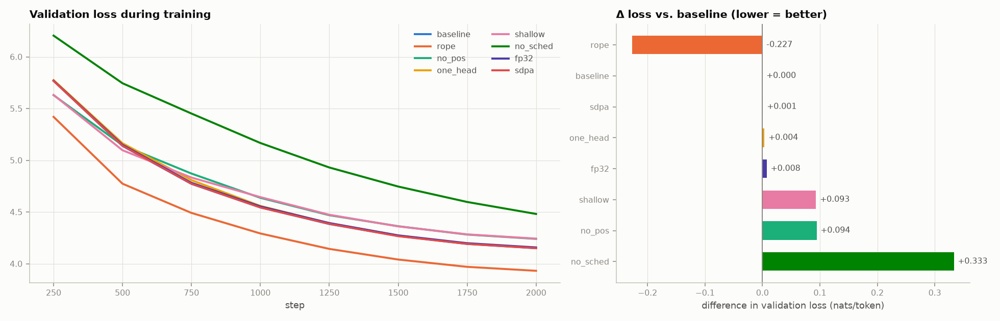

# Ablations (2000 steps each, evaluated on 350,336 val tokens)

| variant | what changed | params | val loss | perplexity | bits/byte | Δ loss | tokens/s | time |
|---|---|---:|---:|---:|---:|---:|---:|---:|
| `baseline` | 6 layers, 6 heads, learned positions, warmup+cosine, fp16 | 10.6M | 4.102 | 60.5 | 1.545 | +0.000 | 52k | 5.3 min |
| `rope` | RoPE positions instead of a learned embedding | 10.6M | 3.875 | 48.2 | 1.459 | -0.227 | 46k | 6.0 min |
| `no_pos` | no position information at all | 10.6M | 4.196 | 66.4 | 1.580 | +0.094 | 52k | 5.3 min |
| `one_head` | a single attention head (instead of 6) | 10.6M | 4.106 | 60.7 | 1.546 | +0.004 | 66k | 4.2 min |
| `shallow` | 2 layers instead of 6 | 3.5M | 4.195 | 66.4 | 1.580 | +0.093 | 117k | 2.4 min |
| `no_sched` | no warmup, constant learning rate | 10.6M | 4.435 | 84.4 | 1.670 | +0.333 | 52k | 5.4 min |
| `fp32` | no mixed precision (fp32 everywhere) | 10.6M | 4.109 | 60.9 | 1.548 | +0.008 | 32k | 8.6 min |
| `sdpa` | PyTorch's fused attention kernel instead of the manual one | 10.6M | 4.103 | 60.5 | 1.545 | +0.001 | 68k | 4.0 min |

